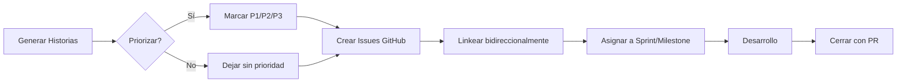

# 🔄 Flujo de Gestión de Historias ECO

**Versión:** 1.0  
**Fecha:** 5 de febrero de 2026

---

## 📋 Visión General



---

## 🎯 Fase 1: Generación de Historias

### Dónde se crean
- **Fuente de verdad:** `docs/04-planificacion/historias-completas-150.md` (o similar)
- Markdown simple, formato libre
- No importa si son 10 o 200 historias

### Formato recomendado por historia
```markdown
**CODIGO-XX: Título descriptivo**  
Como [rol] quiero [acción] para [beneficio].  
**Estimación:** S/M/L/XL | **Prioridad:** P1/P2/P3/Sin definir
```

### Ejemplo
```markdown
**API-01: Schema GraphQL para MANTIA**  
Como desarrollador quiero queries/mutations GraphQL para tareas.  
**Estimación:** L | **Prioridad:** P1
```

---

## 🔍 Fase 2: Priorización (Opcional)

### Cuándo priorizar
- ✅ **Antes de crear issues:** Si ya sabes qué harás primero
- ✅ **Después de crear issues:** Si quieres tener todo en GitHub primero y priorizar ahí
- ✅ **Nunca:** Si son historias exploratorias o backlog futuro

### Criterios de prioridad sugeridos
| Prioridad | Definición | Ejemplos |
|-----------|------------|----------|
| **P1** | MVP, bloqueante para todo lo demás | Auth, CRUD básicos, APIs base |
| **P2** | Importante UX, valor alto | Notificaciones, gráficos, filtros avanzados |
| **P3** | Nice-to-have, optimizaciones | Temas, gamificación, integraciones opcionales |
| **Sin definir** | Backlog futuro, ideas exploratorias | Features muy avanzadas, R&D |

### Herramientas de priorización
- **MoSCoW:** Must have / Should have / Could have / Won't have
- **Valor vs Esfuerzo:** Matriz 2x2 (alto valor + bajo esfuerzo = P1)
- **Dependencias:** Si A depende de B, B es P1

---

## 📤 Fase 3: Crear Issues en GitHub

### Opción A: Script Automatizado (Recomendado)
Usamos PowerShell para crear issues masivamente desde el archivo Markdown.

**Script:** `.temp-issues/create-bulk-issues.ps1`

```powershell
# Parámetros
$repoOwner = "falberio"
$repoName = "eco"
$token = $env:GITHUB_TOKEN
$inputFile = "docs/04-planificacion/historias-completas-150.md"

# Parsear historias del Markdown
# Crear issue por cada una con:
# - Title: CODIGO-XX: Título
# - Body: Historia completa + estimación
# - Labels: prioridad-p1, estimacion-L, etc.
# Guardar mapeo CODIGO -> #Issue
```

### Opción B: Manual por Lotes
1. Seleccionar 10-20 historias prioritarias
2. Crear issues manualmente en GitHub
3. Copiar número de issue al Markdown

### Labels sugeridos en GitHub
- `prioridad-p1`, `prioridad-p2`, `prioridad-p3`
- `estimacion-S`, `estimacion-M`, `estimacion-L`, `estimacion-XL`
- `modulo-mantia`, `modulo-alacena`, `modulo-lista`, `modulo-ecosalud`
- `tipo-api`, `tipo-agente-ia`, `tipo-ux`, `tipo-infra`
- `estado-backlog`, `estado-sprint`, `estado-bloqueado`

---

## 🔗 Fase 4: Linkear Bidireccionalmente

### En Markdown (docs)
Agregar link a issue de GitHub:

```markdown
**API-01: Schema GraphQL para MANTIA** (#143)
```

### En GitHub Issue
Agregar en descripción:

```markdown
**Documentación:** [historias-completas-150.md](https://github.com/falberio/eco/blob/main/docs/04-planificacion/historias-completas-150.md#api-01-schema-graphql-para-mantia)
```

### Script para automatizar
```powershell
# Update Markdown con números de issue
# Update cada issue con link a docs
```

---

## 📆 Fase 5: Asignar a Sprint/Milestone

### Milestones sugeridos
- **Sprint 1 (actual):** 18 historias básicas (ya definidas)
- **v0.1 MVP:** CRUD completo de 4 módulos + Auth (~40 historias)
- **v0.2 IA Básica:** APIs GraphQL + Agente texto (~25 historias)
- **v0.3 Multi-usuario:** Roles + Notificaciones (~20 historias)
- **v0.4 Integraciones:** Google Cal, Fit, Home Assistant (~15 historias)
- **v1.0 Completo:** Todo lo demás (~60 historias)

### Cómo asignar en GitHub
1. Crear Milestone con nombre y fecha
2. Agregar issues al Milestone
3. Filtrar por Milestone en Projects

### Projects (opcional)
- Usar GitHub Projects para tablero Kanban
- Columnas: Backlog → Sprint Actual → En Progreso → Review → Done
- Automatizar movimiento cuando cambias labels

---

## 🛠️ Fase 6: Desarrollo (ya documentado en procedimientos.md)

Ver [procedimientos.md](./procedimientos.md) para workflow completo de desarrollo.

**Resumen:**
1. Elegir historia del Sprint
2. Crear branch `feat/CODIGO-XX-descripcion`
3. Desarrollar
4. PR con `Closes #XX` en descripción
5. Merge → Issue se cierra automáticamente

---

## 🎯 Decisiones de Gestión

### ¿Crear issues de TODO el backlog (161 historias) o solo las priorizadas?

| Opción | Ventajas | Desventajas |
|--------|----------|-------------|
| **TODO** | • Visibilidad completa en GitHub<br>• Fácil priorizar ahí<br>• No perder ideas | • 161 issues intimida<br>• Ruido en repo<br>• Mantenimiento pesado |
| **Solo P1/P2** | • Repo limpio<br>• Foco en importante<br>• Menos mantenimiento | • Ideas P3 se pueden perder<br>• Requiere volver a docs para recordar |
| **Por Milestone** | • Crear solo las del próximo Milestone<br>• Balance entre visibilidad y limpieza | • Requiere disciplina de revisión periódica |

### ✅ Recomendación Personal
**Crear TODO el backlog en GitHub pero:**
- Usar labels agresivamente para filtrar
- Crear view en Projects solo para P1/P2
- Cerrar issues muy lejanas como "no planned" si cambia prioridad

**Razón:** GitHub es gratis, tiene búsqueda potente, y si está ahí es más fácil que alguien contribuya o lo encuentres en el futuro.

---

## 🔄 Mantenimiento del Backlog

### Revisión Semanal (Sprint Planning)
1. Revisar issues cerradas del Sprint anterior
2. Priorizar siguientes 10-15 historias para próximo Sprint
3. Actualizar estimaciones si aprendiste algo nuevo
4. Archivar/cerrar historias obsoletas

### Revisión Mensual (Roadmap)
1. Re-priorizar Milestones según aprendizajes
2. Agregar nuevas historias si surgen necesidades
3. Eliminar historias que ya no tienen sentido

### Revisión Trimestral (Producto)
1. Validar si Milestones siguen alineados con visión
2. Ajustar roadmap según feedback de usuarios
3. Celebrar progreso 🎉

---

## 📊 Métricas Útiles

### En GitHub
- **Velocity:** Historias completadas por Sprint (medir en puntos de estimación)
- **Burndown:** Issues restantes vs tiempo
- **Cycle time:** Tiempo desde apertura hasta cierre de issue

### En Docs
- **Coverage:** % de módulos con historias definidas
- **Balance:** Distribución equitativa entre módulos

---

## 🛠️ Herramientas Recomendadas

### Scripts a crear
1. ✅ `create-bulk-issues.ps1` - Crear 161 issues de una
2. ✅ `sync-docs-to-github.ps1` - Actualizar números de issue en Markdown
3. ✅ `generate-sprint-report.ps1` - Resumen de Sprint completado
4. ⏳ `estimate-velocity.ps1` - Calcular velocity promedio

### Extensiones GitHub
- **GitHub CLI (`gh`):** Crear issues desde terminal
- **GitHub Projects:** Tablero Kanban integrado
- **ZenHub:** Kanban avanzado (opcional, de pago)

---

## 🎯 Próximo Paso Inmediato

**DECISIÓN REQUERIDA:**

¿Quieres que cree el script para generar las 161 issues en GitHub ahora mismo?

**Opciones:**
1. ✅ **Sí, crear script y ejecutar** (tardará ~5-10 min en correr)
2. ⏸️ **Crear script pero no ejecutar** (lo revisas y corres manual)
3. 🔍 **Primero priorizar manualmente** (elegir solo 40-50 para crear)
4. 📝 **Solo documentar flujo** (crear issues en otra sesión)

---

**¿Cuál prefieres?**
