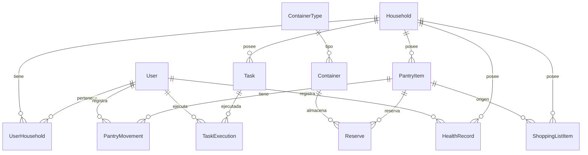

# 🗄️ Modelo de Datos

**Última actualización:** 04 Febrero 2026  
**Sprint:** Sprint 0

---

## 🎯 Propósito

Documentación completa del modelo de datos de ECO. Alineado con el schema Prisma actual en `backend/prisma/schema.prisma`.

> **Nota:** Este documento refleja el estado actual + extensiones planificadas para Sprint 1.

---

## 📊 Diagrama Entidad-Relación



---

## 👥 Capa de Soporte

### User

Representa un usuario del sistema.

```prisma
model User {
  id            String   @id @default(uuid())
  email         String   @unique
  password_hash String
  name          String?
  role          String   @default("user")  // "admin" | "user"
  created_at    DateTime @default(now())
  updated_at    DateTime @updatedAt
}
```

**Campos:**
- `id`: UUID único
- `email`: Email único del usuario
- `password_hash`: Hash bcrypt del password
- `name`: Nombre completo (opcional)
- `role`: Rol del usuario (admin tiene accesos adicionales)

**Relaciones:**
- `UserHousehold[]`: Hogares a los que pertenece

---

### Household

Representa un hogar (unidad de aislamiento de datos).

```prisma
model Household {
  id         String   @id @default(uuid())
  name       String
  created_at DateTime @default(now())
}
```

**Campos:**
- `id`: UUID único
- `name`: Nombre del hogar (ej: "Casa Alberio")

**Relaciones:**
- `UserHousehold[]`: Usuarios del hogar
- `PantryItem[]`: Items de alacena
- `Task[]`: Tareas
- `ShoppingListItem[]`: Items de lista
- `HealthRecord[]`: Registros de salud

---

### UserHousehold

Relación muchos-a-muchos entre usuarios y hogares.

```prisma
model UserHousehold {
  user_id      String
  household_id String
  role         String   @default("member")  // "owner" | "member"
  joined_at    DateTime @default(now())
  
  @@id([user_id, household_id])
}
```

**Campos:**
- `user_id`: Referencia a User
- `household_id`: Referencia a Household
- `role`: Rol del usuario en el hogar (owner puede gestionar miembros)

---

## 🏺 ALACENA

### PantryItem

Item de inventario (alimento, producto, etc.).

```prisma
model PantryItem {
  id           String   @id @default(uuid())
  household_id String
  code         String?  @unique
  name         String
  category     String?
  unit         String   @default("unidad")
  location     String?
  notes        String?
  created_at   DateTime @default(now())
  updated_at   DateTime @updatedAt
}
```

**Campos:**
- `household_id`: Hogar al que pertenece
- `code`: Código único opcional (ej: "ARR-001")
- `name`: Nombre del item (ej: "Arroz integral")
- `category`: Categoría (ej: "Granos", "Lácteos")
- `unit`: Unidad de medida (g, ml, unidad, kg)
- `location`: Ubicación física (ej: "Alacena principal")

**Relaciones:**
- `PantryMovement[]`: Movimientos (ingreso/consumo)
- `Reserve[]`: Reservas en contenedores

---

### PantryMovement

Movimiento de stock (ingreso, consumo, ajuste).

```prisma
model PantryMovement {
  id         String   @id @default(uuid())
  item_id    String
  user_id    String
  type       String   // "ingreso" | "consumo" | "ajuste"
  quantity   Float
  timestamp  DateTime @default(now())
  notes      String?
}
```

**Campos:**
- `item_id`: Item afectado
- `user_id`: Usuario que registró
- `type`: Tipo de movimiento
- `quantity`: Cantidad (positiva o negativa)
- `notes`: Notas opcionales

**Lógica:**
- `ingreso`: Sumar al stock
- `consumo`: Restar del stock
- `ajuste`: Setear stock directamente

---

### Container

Contenedor físico (frasco, tupperware).

```prisma
model Container {
  id              String  @id @default(uuid())
  code            String  @unique
  name            String?
  location_id     String?
  current_item_id String?
  shelf_row       Int?
  shelf_col       Int?
  capacity_ml     Int?
  typeId          String?
  created_at      DateTime @default(now())
  updated_at      DateTime @updatedAt
}
```

**Campos:**
- `code`: Código único (ej: "JAR-001")
- `typeId`: Tipo de contenedor (referencia a ContainerType)
- `capacity_ml`: Capacidad en ml
- `current_item_id`: Item actual almacenado
- `shelf_row`, `shelf_col`: Ubicación en estantería

**Relaciones:**
- `ContainerType`: Tipo del contenedor
- `Reserve[]`: Reservas históricas

---

### ContainerType

Tipo de contenedor con tara definida.

```prisma
model ContainerType {
  id          String @id @default(uuid())
  name        String @unique
  description String?
  tareWeight_g Float
  capacity_ml Int?
  created_at  DateTime @default(now())
  updated_at  DateTime @updatedAt
}
```

**Campos:**
- `name`: Nombre del tipo (ej: "JAR-750-LOW")
- `tareWeight_g`: Peso de tara en gramos
- `capacity_ml`: Capacidad típica en ml

**Tipos existentes:**
- JAR-750-LOW: 637g
- JAR-750-HIGH: 692g
- JAR-1000: 746g
- JAR-1500: 929g

---

### Reserve

Registro de contenido de un contenedor en un momento.

```prisma
model Reserve {
  id           String   @id @default(uuid())
  container_id String
  item_id      String
  weight_g     Float
  timestamp    DateTime @default(now())
}
```

**Campos:**
- `container_id`: Contenedor
- `item_id`: Item almacenado
- `weight_g`: Peso neto en gramos
- `timestamp`: Momento del registro

---

## 📋 MANTIA

### Task

Tarea del hogar.

```prisma
model Task {
  id               String   @id @default(uuid())
  household_id     String
  title            String
  description      String?
  category         String?
  periodicity      String?  // "daily" | "weekly" | "monthly" | null
  state            String   @default("active")  // "active" | "paused" | "completed"
  next_suggested   DateTime?
  created_at       DateTime @default(now())
  updated_at       DateTime @updatedAt
}
```

**Campos:**
- `household_id`: Hogar al que pertenece
- `title`: Título de la tarea
- `description`: Descripción detallada (opcional)
- `category`: Categoría (ej: "Limpieza", "Mantenimiento")
- `periodicity`: Frecuencia (diaria, semanal, mensual, null para única)
- `state`: Estado actual
- `next_suggested`: Próxima fecha sugerida (calculada)

**Relaciones:**
- `TaskExecution[]`: Historial de ejecuciones

---

### TaskExecution

Registro de ejecución de una tarea.

```prisma
model TaskExecution {
  id        String   @id @default(uuid())
  task_id   String
  user_id   String
  timestamp DateTime @default(now())
  notes     String?
}
```

**Campos:**
- `task_id`: Tarea ejecutada
- `user_id`: Usuario que ejecutó
- `timestamp`: Momento de ejecución
- `notes`: Notas opcionales (ej: "Se cambió filtro")

**Lógica:**
Al crear una ejecución, recalcular `next_suggested` de la tarea basado en `periodicity`.

---

## 🛒 Lista de Compras

### ShoppingListItem

Item de la lista de compras.

```prisma
model ShoppingListItem {
  id            String   @id @default(uuid())
  household_id  String
  name          String
  quantity      Float?
  unit          String?
  origin        String   @default("manual")  // "manual" | "alacena" | "mantia"
  origin_ref_id String?
  state         String   @default("pending")  // "pending" | "purchased"
  created_at    DateTime @default(now())
  updated_at    DateTime @updatedAt
}
```

**Campos:**
- `household_id`: Hogar al que pertenece
- `name`: Nombre del item a comprar
- `quantity`: Cantidad (opcional)
- `unit`: Unidad (opcional)
- `origin`: Origen del item (manual, desde alacena, desde mantia)
- `origin_ref_id`: ID del item original (si aplica)
- `state`: Estado (pendiente, comprado)

**Flujos:**
- **Manual:** Usuario agrega directo
- **Desde ALACENA:** Cuando stock < mínimo, usuario puede "Agregar a lista"
- **Desde MANTIA:** Al ejecutar tarea, puede agregar insumos necesarios

---

## 💊 ECOSALUD

### HealthRecord

Registro de salud y bienestar.

```prisma
model HealthRecord {
  id           String   @id @default(uuid())
  household_id String
  user_id      String
  type         String   // "weight" | "pressure" | "glucose" | "note"
  value        String   // JSON flexible
  timestamp    DateTime @default(now())
  notes        String?
}
```

**Campos:**
- `household_id`: Hogar
- `user_id`: Usuario del registro
- `type`: Tipo de registro
- `value`: Valor (JSON para flexibilidad)
- `timestamp`: Momento del registro
- `notes`: Notas adicionales

**Ejemplos de `value`:**
- Peso: `{"kg": 75.5}`
- Presión: `{"systolic": 120, "diastolic": 80}`
- Glucosa: `{"mg_dl": 95}`
- Nota: `{"text": "Me siento bien hoy"}`

---

## 📍 Ubicaciones (Soporte)

### Location

Ubicación física en el hogar.

```prisma
model Location {
  id         String   @id @default(uuid())
  name       String
  type       String   // "shelf" | "pantry" | "fridge" | "freezer"
  created_at DateTime @default(now())
  updated_at DateTime @updatedAt
}
```

**Uso:** Referenciado desde Container y PantryItem.

---

## 🔗 Relaciones Clave

### Multi-tenancy por Hogar
**Todas las entidades principales** tienen `household_id` y **SIEMPRE** deben filtrarse por él:
- PantryItem
- Task
- ShoppingListItem
- HealthRecord

### Trazabilidad de Origen
- `ShoppingListItem.origin_ref_id` → Referencia a `PantryItem.id` o `Task.id`
- `PantryMovement.user_id` → Quién registró
- `TaskExecution.user_id` → Quién ejecutó
- `HealthRecord.user_id` → De quién es el registro

### Historial
- `PantryMovement`: Historial completo de alacena
- `TaskExecution`: Historial de cumplimiento
- `Reserve`: Historial de contenedores
- `HealthRecord`: Historial de salud

---

## 🔧 Migraciones Prisma

### Comandos
```bash
# Crear migración
npx prisma migrate dev --name nombre_migracion

# Aplicar migraciones en producción
npx prisma migrate deploy

# Resetear DB (⚠️ SOLO DEV)
npx prisma migrate reset

# Ver estado
npx prisma migrate status
```

### Convenciones
- Nombres en snake_case
- Prefijo descriptivo (ej: `add_task_tables`, `fix_tara_weights`)
- Una responsabilidad por migración

---

## 🔗 Enlaces

- [ADRs](adrs.md)
- [Inventario AS-IS](inventario-as-is.md)
- [Documento Funcional](../02-documento-funcional.md)
- [Schema Prisma actual](../../backend/prisma/schema.prisma)

---

**Última actualización:** 04 Febrero 2026  
**Próxima revisión:** Inicio Sprint 1 (10 Feb 2026)
