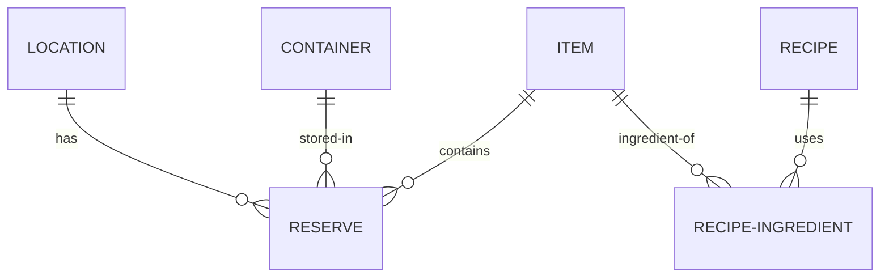

# 🤖 INSTRUCCIONES PARA TRABAJAR CON GITHUB COPILOT — ECO

**Última actualización:** 5 de febrero de 2026  
**Proyecto:** ECO (Sistema de Gestión Doméstica Modular)  
**Público:** Fran + GitHub Copilot

---

## ⚡ COMANDOS ESPECIALES

### 🚪 Cierre de Sesión
**Comando:** `"Vamos cerrando el orto"`

Cuando el usuario dice esta frase, ejecutar automáticamente:
1. ✅ Documentar TODO lo trabajado en la sesión actual
2. ✅ Crear/actualizar archivo en `docs/sesiones/YYYY-MM-DD--nombre-sesion.md`
3. ✅ Incluir métricas: duración, commits, issues creados, archivos modificados
4. ✅ Hacer commit con mensaje descriptivo del resumen de sesión
5. ✅ Push a GitHub
6. ✅ Desplegar documentación si hubo cambios (mkdocs gh-deploy o esperar workflow)
7. ✅ Mensaje final con resumen y links a documentación/issues

**Formato de documentación de sesión:**
```markdown
# Sesión N - Título Descriptivo
**Fecha:** DD de mes YYYY
**Duración:** XXX minutos
**Objetivo:** Breve descripción

## Logros
- Lista de completados
- Issues creados/cerrados
- Cambios principales

## Métricas
| Métrica | Valor |
|---------|-------|
| Duración | XX min |
| Commits | N |
| Issues | N |

## Próxima Sesión
- Objetivos para mañana
```

---

## 📋 ÍNDICE
1. [Comandos Especiales](#comandos-especiales)
2. [Reglas de Comunicación](#reglas-de-comunicación)
3. [Ejecución de Comandos](#ejecución-de-comandos)
4. [Commits y Versionado](#commits-y-versionado)
5. [Código y Desarrollo](#código-y-desarrollo)
6. [Documentación y Diagramas](#documentación-y-diagramas)
7. [Decisiones y Preguntas](#decisiones-y-preguntas)
8. [Testing y Verificación](#testing-y-verificación)
9. [Cómo Usar Este Documento](#cómo-usar-este-documento)

---

## 1️⃣ REGLAS DE COMUNICACIÓN

### Estructura de respuestas
- ✅ **Un paso único por mensaje** (a menos que sean independientes y fast).
- ✅ **Preguntas confirmatorias** antes de actuar (para que entiendas más).
- ✅ **Resumen breve** al inicio (estado actual, qué va a pasar).
- ✅ **Lenguaje claro** en español, sin tecnicismos innecesarios.

### Pedir ayuda
- Si no entiende algo, dilo: "Explícame por qué hacemos X así".
- Si quieres comparar opciones: "¿Cuál es mejor, opción A o B? Muéstrame la diferencia".
- Si hay dudas: pregunta antes de que yo actúe.

### Velocidad vs. Precisión
- **Modo por defecto:** Punto medio (código funcional + explicación).
- **Si es urgente:** dime "rápido" y me salto explicaciones largas.
- **Si es crítico:** dime "detallado" y comento cada línea, hago tests, etc.

---

## 2️⃣ EJECUCIÓN DE COMANDOS

### Formato
- ✅ **SIEMPRE incluir ruta exacta** al inicio del comando.
- ✅ **Usar `npm.cmd` en PowerShell/CMD** (evitar `npm` directo por políticas).
- ✅ **Ruta sintética permitida** si es evidente (ej: "anda a backend" en lugar de full path).
- ✅ **Esperar salida y reportar** antes de siguiente paso.

### Ejemplos válidos
```bash
# Opción 1: Ruta completa (explícito)
cd C:\Users\Usuario\alacena\backend && npm.cmd run prisma:generate

# Opción 2: Ruta sintética (si es clara)
# "anda a backend y ejecuta:" npm.cmd run prisma:seed
```

### Terminales permitidas
- ✅ PowerShell (con `npm.cmd`, no `npm`)
- ✅ CMD (con `npm.cmd`)
- ✅ Bash (Git Bash, con `npm`)
- ❌ PowerShell directo sin `.cmd` (bloqueo de políticas)

---

## 3️⃣ COMMITS Y VERSIONADO

### Formato de mensaje
```
type: descripción breve (en español o inglés)

Ejemplos válidos:
- feat: endpoint POST /api/spaces (crear ubicaciones)
- fix: validación de cantidad en reservas
- docs: actualizar README con guía de setup
- refactor: reorganizar controllers en carpeta routes
- seed: agregar datos iniciales de test
```

### Frequency
- ✅ **Un commit por feature** (o por paso lógico importante).
- ✅ **No commits cada cambio de línea** (agrupar lo relacionado).
- ✅ **Descripción clara** para que en 6 meses entiendas qué hiciste.

### Antes de commitear
- Verificar que no hay `.env` o secretos.
- Asegurar que el código no quebró nada.
- Si es un cambio grande, hacer commit + prueba.

---

## 4️⃣ CÓDIGO Y DESARROLLO

### Estilo
- ✅ **Nomenclatura camelCase** para variables/funciones.
- ✅ **UPPERCASE** para constantes.
- ✅ **Nombres descriptivos** (no `x`, `y`, `temp`).

### Validación
- ✅ **Usar Zod** para validar inputs de APIs.
- ✅ **Tipado** en TypeScript donde sea posible (controller, routes, services).
- ✅ **Error handling** claro (mensajes útiles para debug).

### Estructura
- ✅ **Seguir estructura existente** en `/backend/src`.
- ✅ **Controllers** en `backend/src/controllers/`.
- ✅ **Routes** en `backend/src/routes/`.
- ✅ **Services/lógica** en `backend/src/services/` si es reutilizable.
- ✅ **Prisma queries** en services o controllers (según complejidad).

### Comments en código
- ✅ **Español**, visible en línea.
- ✅ **Explicar WHY, no WHAT** (el código ya dice qué; explica por qué).
- ✅ **Brevemente** (1-2 líneas máximo por comment).

Ejemplo:
```javascript
// ❌ MAL
const users = prisma.user.findMany(); // obtener usuarios

// ✅ BIEN
// Obtenemos usuarios activos para evitar mostrar cuentas deshabilitadas
const users = await prisma.user.findMany({ where: { active: true } });
```

---

## 5️⃣ DOCUMENTACIÓN Y DIAGRAMAS

### Documentación en el repo
- ✅ **README.md** en raíz (descripción general, quick start).
- ✅ **docs/SETUP.md** (instalación, dependencias, variables de entorno).
- ✅ **docs/ARQUITECTURA.md** (decisiones técnicas, stack, por qué PostgreSQL, etc.).
- ✅ **docs/MODELOS-DATOS.md** (schema Prisma explicado, relaciones).
- ✅ **docs/API.md** (endpoints disponibles, requests/responses).
- ✅ **docs/GUIA-DESARROLLO.md** (cómo contribuir, convenciones, tests).
- ✅ **docs/conversaciones/** (histórico de chats por fecha).

### Diagramas visuales (IMPORTANTE)
- ✅ **Diagrama ER** (Entity-Relationship) de la BD.
- ✅ **Diagrama de arquitectura** (frontend, backend, DB, Vercel, etc.).
- ✅ **Flujos de usuario** (ej: "cómo añade una reserva el usuario").
- ✅ **Diagrama de componentes frontend** (si aplica).

**Formatos permitidos:**
- **Mermaid** (sintaxis simple, incrustable en GitHub/MD) — RECOMENDADO.
- **PlantUML** (más potente, visual).
- **Excalidraw** (visual, collaborative).
- **Figma** (si prefieres diseño más elaborado).

**Dónde guardarlas:**
- **Mermaid/PlantUML:** en archivos `.md` dentro de `docs/`.
- **Excalidraw/Figma:** exportar PNG/PDF a `docs/diagrams/`.

Ejemplo Mermaid (ER diagram):
````markdown

````

### Actualizar documentación
- ✅ **Cada cambio importante** → actualizar los docs relevantes.
- ✅ **Junto con el código** (no dejar docs desactualizados).
- ✅ **Revisar PRE-commit** (si los docs dicen una cosa y el código otra = bug).

---

## 6️⃣ DECISIONES Y PREGUNTAS

### Antes de actuar
- ✅ **Si hay múltiples formas** de hacer algo → preguntarte opciones.
- ✅ **Si es diseño importante** → confirmarte qué enfoque prefieres.
- ✅ **Si hay trade-offs** (seguridad vs velocidad, ej) → explicarlos.

### Formato de pregunta
```
Veo que necesitas crear endpoint para [X]. Hay 2 formas:

A) Opción rápida: [descripción, ventajas, desventajas]
B) Opción robusta: [descripción, ventajas, desventajas]

¿Cuál prefieres? O te sugiero la A porque [razón].
```

### Decisiones tomadas = guardar
- ✅ Si decidimos algo importante (ej: "autenticación con JWT"), guardar en `docs/DECISIONES.md`.
- ✅ Formato: fecha, decisión, razón, alternativas descartadas.

---

## 7️⃣ TESTING Y VERIFICACIÓN

### Nivel de testing
- ✅ **Al inicio:** prueba manual de comandos (ejecutar y verificar salida).
- ✅ **Conforme avanzo:** si el código no quebró, asumir que está bien.
- ✅ **Si es crítico:** hacer tests explícitos (ej: probar endpoint con curl).

### Antes de dar por terminado
- ✅ El comando/endpoint debe ejecutarse sin errores visibles.
- ✅ Si hay warnings (no errors), reportar pero no frenar.
- ✅ Decirte claramente si falta algo o si está listo.

---

## 8️⃣ CÓMO USAR ESTE DOCUMENTO

### Para nuevas sesiones (IMPORTANTE)
**Copia y pega esto al inicio de un nuevo chat con Copilot:**

```
---
LEE el archivo docs/COPILOT-INSTRUCCIONES.md y úsalo como guía para toda nuestra comunicación.

Resumen rápido:
- Paso único por mensaje (confirmaciones antes de actuar)
- Incluir ruta en comandos (pero sintética está bien)
- Un commit por feature
- Documentar todo (README, SETUP, ARQUITECTURA, API, diagramas)
- Preguntar antes si hay opciones
- Testing manual básico
- Comentarios en código en español (WHY, no WHAT)

Estamos en etapa: [Migraciones completadas | Endpoints CRUD | Página pública] ← actualizar según estés

Próximo objetivo: [qué hacemos ahora] ← actualizar según sea
---
```

### Actualizaciones al documento
- Si surge una nueva regla importante → editar este archivo.
- Si algo no funcionó o fue confuso → comentalo y ajustamos.
- Hacer commit cada vez que actualicemos este doc (`docs: actualizar COPILOT-INSTRUCCIONES`).

---

## 🎯 REFERENCIA RÁPIDA

| Aspecto | Regla |
|--------|-------|
| **Comandos** | Ruta + `npm.cmd` + esperar salida |
| **Commits** | `type: descripción` (1 por feature) |
| **Código** | Zod validation, TypeScript, camelCase, comments en español |
| **Docs** | README, SETUP, ARQUITECTURA, MODELOS, API, GUÍA, conversaciones |
| **Diagramas** | Mermaid (preferred), PlantUML, o Excalidraw |
| **Preguntas** | Confirmatorias antes de actuar |
| **Testing** | Manual básico, reportar si quebró |

---

**Última revisión:** 2026-01-12  
**Revisor:** Fran + GitHub Copilot  
**Próxima revisión:** Según sea necesario
