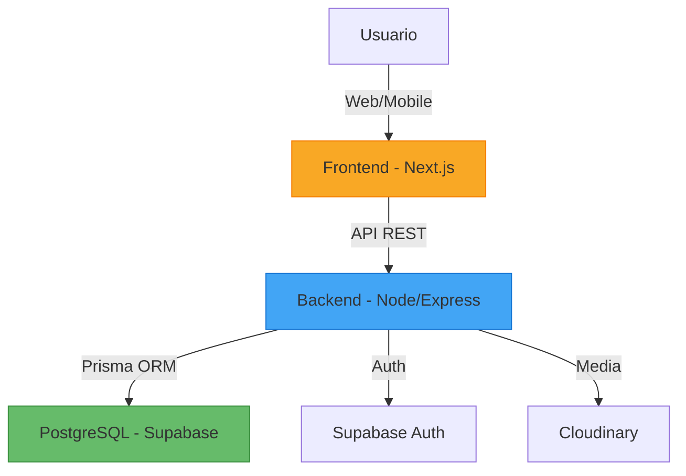

# 🏠 Bienvenido a ECO

**Sistema de Gestión Doméstica Modular**

---

## 🎯 ¿Qué es ECO?

ECO es un **sistema personal/modular** para gestionar la vida doméstica con foco en **registro, historial y simplicidad operativa**. Diseñado para descargar tu mente y mantener un historial completo de todo lo que sucede en tu hogar.

!!! info "Sprint Actual: Sprint 0"
    **Cierre:** 09 Febrero 2026  
    **Objetivo:** Consolidar marco del producto (documentación, backlog, ADRs)

---

## ⚡ Quick Start

### Primera Vez Aquí

Si es tu primera vez, sigue este orden:

1. **[📋 Contexto General](01-contexto-general.md)** → Qué es ECO y qué no es
2. **[📘 Documento Funcional](02-documento-funcional.md)** → Modelo de datos, ADRs, alcance
3. **[🗓️ Roadmap](04-planificacion/roadmap.md)** → Planificación de sprints

### Desarrolladores

1. Lee el **[Documento Funcional](02-documento-funcional.md)** completo
2. Revisa **[ADRs](05-arquitectura/adrs.md)** y **[Modelo de Datos](05-arquitectura/modelo-datos.md)**
3. Consulta **[Procedimientos](05-arquitectura/procedimientos.md)** para deploys
4. Usa el **[Cheatsheet](07-cheatsheet.md)** para comandos frecuentes

---

## 🧩 Módulos Funcionales

ECO está compuesto por módulos independientes que trabajan juntos:

-   :material-food-apple:{ .lg .middle } **ALACENA**

    ---

    Gestión de inventario doméstico con control de stock, movimientos y categorización.

    [:octicons-arrow-right-24: Ver más](02-documento-funcional.md#alacena)

-   :material-clipboard-check:{ .lg .middle } **MANTIA**

    ---

    Tareas y mantenimiento del hogar con historial de ejecuciones y periodicidad.

    [:octicons-arrow-right-24: Ver más](02-documento-funcional.md#mantia)

-   :material-heart-pulse:{ .lg .middle } **ECOSALUD**

    ---

    Registro de salud y bienestar personal con historial cronológico.

    [:octicons-arrow-right-24: Ver más](02-documento-funcional.md#ecosalud)

-   :material-home:{ .lg .middle } **HUESHA**

    ---

    Gestión de espacios físicos y organización del hogar _(futuro)_.

    [:octicons-arrow-right-24: Roadmap](04-planificacion/roadmap.md)

-   :material-cash:{ .lg .middle } **FINANCIA**

    ---

    Gestión financiera doméstica y presupuestos _(futuro)_.

    [:octicons-arrow-right-24: Roadmap](04-planificacion/roadmap.md)

-   :material-cart:{ .lg .middle } **Lista de Compras**

    ---

    Transversal: alimentada por todos los módulos para centralizar necesidades.

    [:octicons-arrow-right-24: Ver más](02-documento-funcional.md#lista-de-compras)

---

## 🏗️ Arquitectura

### Stack Tecnológico

### Decisiones Clave (ADRs)

- ✅ **ADR-001:** Monolito modular (no microservicios)
- ✅ **ADR-002:** Aislamiento por hogar (multi-tenancy básico)
- ✅ **ADR-003:** Autenticación básica (email/password)
- ✅ **ADR-004:** Periodicidad declarativa en MANTIA
- ✅ **ADR-005:** Lista de Compras transversal

[:octicons-arrow-right-24: Ver todas las ADRs](05-arquitectura/adrs.md)

---

## 📊 Estado del Proyecto

### Sprint 0: Documentación y Planificación
**Fechas:** 01 Feb - 09 Feb 2026

??? success "Completado ✅"
    - Estructura documental definida
    - Migración de ECO.htm a Markdown
    - Configuración de MkDocs Material
    - README maestro creado

??? warning "En progreso ⏳"
    - Backlog detallado Sprint 1
    - Plan de proyecto completo
    - Documentación técnica (ADRs, modelo de datos)

### Sprint 1: MVP Operable
**Fechas:** 10 Feb - 23 Feb 2026  
**Objetivo:** Sistema utilizable en el día a día

---

## 🌐 URLs en Producción

| Entorno | URL | Estado |
|---------|-----|--------|
| **Frontend** | [alacena-blush.vercel.app](https://alacena-blush.vercel.app) | ✅ Activo |
| **Backend API** | [alacena-backend.fly.dev](https://alacena-backend.fly.dev) | ✅ Activo |
| **Database** | Supabase PostgreSQL | ✅ Activo |

### Credenciales de Prueba

!!! example "Acceso de Prueba"
    **Admin:** admin@alacena.com / admin123  
    **Usuario:** user@alacena.com / user123

---

## 📚 Documentación

### Documentos Core

| Documento | Propósito | Actualización |
|-----------|-----------|---------------|
| [Contexto General](01-contexto-general.md) | Visión, principios, límites | Muy baja |
| [Documento Funcional](02-documento-funcional.md) | **Fuente de verdad** | Alta (cada sprint) |
| [Libro de Sesiones](03-libro-sesiones.md) | Minutas y decisiones | Continua |

### Por Tema

=== "Planificación"
    - [Backlog Maestro](04-planificacion/backlog.md)
    - [Roadmap](04-planificacion/roadmap.md)
    - [Sprints](04-planificacion/sprints.md)

=== "Arquitectura"
    - [ADRs](05-arquitectura/adrs.md)
    - [Inventario AS-IS](05-arquitectura/inventario-as-is.md)
    - [Modelo de Datos](05-arquitectura/modelo-datos.md)
    - [Procedimientos](05-arquitectura/procedimientos.md)

=== "UX/Diseño"
    - [UX & Navegación](06-ux-navegacion.md)

=== "Referencia"
    - [Cheatsheet](07-cheatsheet.md)

---

## 🎯 Principios del Proyecto

!!! quote "Principios Rectores"
    1. **Descargar la mente** - Nada crítico solo en memoria
    2. **Registro antes que automatización** - Capturar primero, asistir después
    3. **Historial primero** - Todo evento trazable
    4. **Asistencia progresiva** - El sistema aprende
    5. **Modularidad clara** - Separación de responsabilidades

---

## 🔗 Enlaces Útiles

- [:fontawesome-brands-github: Repositorio](https://github.com/falberio/eco)
- [:material-bug: Issues](https://github.com/falberio/eco/issues)
- [:material-web: Frontend](https://alacena-blush.vercel.app)
- [:material-api: Backend API](https://alacena-backend.fly.dev)

---

## 🤝 Contribuciones

Este es un proyecto personal, pero está documentado profesionalmente para permitir:
- Continuidad en caso de pausas largas
- Onboarding rápido de colaboradores futuros
- Aprendizaje y referencia para otros proyectos

---

**Última actualización:** 04 Febrero 2026  
**Próxima revisión:** Post Sprint 0 (09 Feb 2026)
